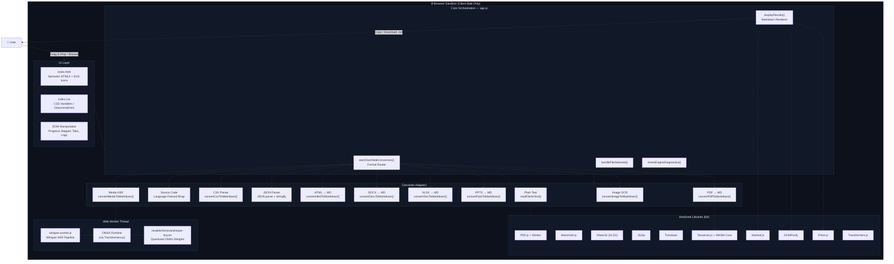
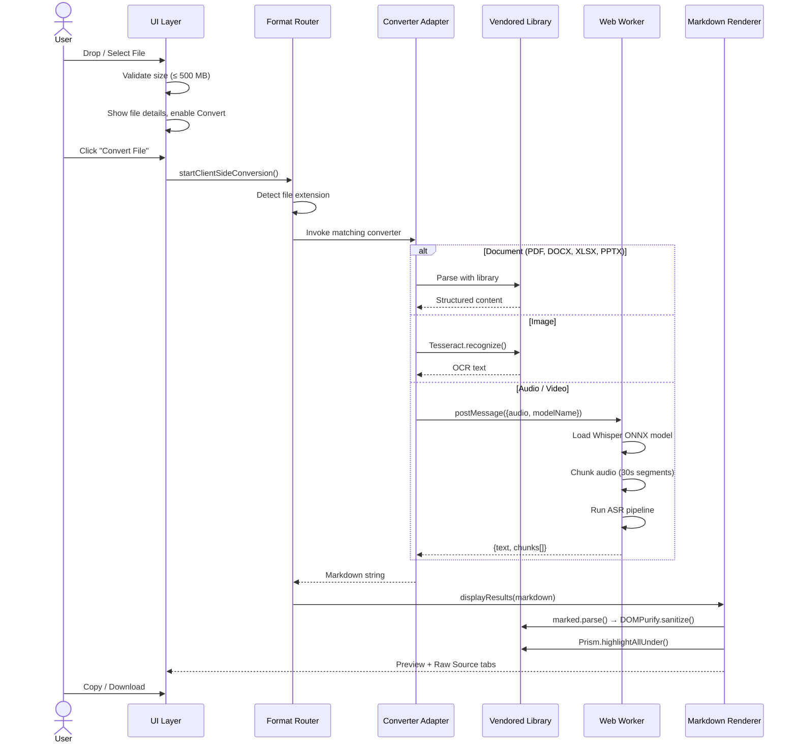

<div align="center">

# 📄 ToMD — File to Markdown Converter

**A privacy-first, fully client-side file conversion engine that transforms 30+ file formats into clean Markdown — no servers, no uploads, no data leaves your browser.**


[](#license)
[](#tech-stack)
[](#architecture)
[](#architecture)

</div>

---

## 📖 Table of Contents

- [Overview](#overview)
- [Key Features](#key-features)
- [Supported File Formats](#supported-file-formats)
- [Architecture](#architecture)
  - [Architecture Diagram](#architecture-diagram)
  - [Data Flow](#data-flow)
  - [Directory Structure](#directory-structure)
- [Tech Stack](#tech-stack)
  - [Core Technologies](#core-technologies)
  - [Client-Side Libraries](#client-side-libraries)
  - [AI / ML Models](#ai--ml-models)
- [Detailed Function Analysis](#detailed-function-analysis)
  - [Application Lifecycle](#1-application-lifecycle--initialization)
  - [File I/O Utilities](#2-file-io-utilities)
  - [Document Converters](#3-document-converters)
  - [Media Processing Pipeline](#4-media-processing-pipeline)
  - [UI Orchestration](#5-ui-orchestration)
  - [Whisper Worker](#6-whisper-web-worker)
- [Getting Started](#getting-started)
- [Configuration Options](#configuration-options)
- [Security & Privacy](#security--privacy)
- [Browser Compatibility](#browser-compatibility)
- [License](#license)

---

## Overview

**ToMD** (To Markdown) is a zero-dependency web application that converts virtually any file format into well-structured Markdown text. It is designed for **LLM context feeding** — converting documents, spreadsheets, presentations, images, audio, and video into a format that large language models can consume directly.

The entire conversion pipeline executes **inside the browser sandbox**. No file is ever uploaded to a remote server. OCR runs via WebAssembly, speech-to-text runs via ONNX Runtime in a Web Worker, and all document parsing is handled by vendored JavaScript libraries.

---

## Key Features

| Feature | Description |
| :--- | :--- |
| 🔒 **Privacy-First** | All processing happens client-side. Zero network requests for file data |
| 📝 **30+ Formats** | PDF, DOCX, PPTX, XLSX, HTML, CSV, JSON, XML, images, audio, video, source code |
| 🧠 **AI-Powered OCR** | Tesseract.js (WASM) extracts text from images and scanned PDFs |
| 🎤 **Speech-to-Text** | Whisper ONNX models transcribe audio/video with timestamps |
| 🎬 **Video Keyframes** | Canvas-based frame capture + OCR for visual content extraction |
| 📊 **Live Progress** | Real-time stage stepper, progress bar, and processing logs |
| 👁️ **Dual View** | Preview rendered Markdown or view raw source with syntax highlighting |
| 📋 **One-Click Export** | Copy to clipboard or download as `.md` file |
| 🌐 **Zero Backend** | Static files only — serve from any HTTP server, GitHub Pages, or `file://` |

---

## Supported File Formats

| Category | Extensions | Conversion Method |
| :--- | :--- | :--- |
| **Documents** | `.pdf` | PDF.js text extraction + Tesseract.js OCR fallback |
| **Word Processing** | `.docx` | Mammoth.js → HTML → Turndown Markdown |
| **Presentations** | `.pptx` | JSZip XML parsing → slide-by-slide text |
| **Spreadsheets** | `.xlsx` | SheetJS workbook parser → Markdown tables |
| **Web** | `.html`, `.htm` | Turndown HTML-to-Markdown translation |
| **Data** | `.csv` | Custom CSV parser → Markdown table |
| **Data** | `.json` | JSON.parse → pretty-printed fenced code block |
| **Data** | `.xml` | Raw XML in fenced code block |
| **Images** | `.png`, `.jpg`, `.jpeg`, `.webp`, `.bmp`, `.gif`, `.tiff` | Tesseract.js WASM OCR |
| **Video** | `.mp4`, `.mkv`, `.avi`, `.mov`, `.webm`, `.flv`, `.wmv`, `.m4v` | Whisper ASR + keyframe canvas OCR |
| **Audio** | `.mp3`, `.wav`, `.m4a`, `.flac`, `.ogg`, `.aac`, `.wma` | Whisper ASR with timestamped chunks |
| **Source Code** | `.py`, `.js`, `.ts`, `.java`, `.c`, `.cpp`, `.go`, `.rs`, `.rb`, `.swift`, `.kt`, `.sql`, `.php`, `.sh`, `.lua`, `.r`, `.scala`, `.cs`, `.pl`, `.m`, `.cls`, `.apex` | Wrapped in language-tagged fenced code blocks |
| **Plain Text** | `.txt`, `.md`, `.log`, `.cfg`, `.ini`, `.yaml`, `.toml`, `.env`, `.properties`, `.gitignore`, `.dockerignore`, `.editorconfig` | Direct passthrough |

---

## Architecture

### Architecture Diagram



### Data Flow



### Directory Structure

```
tomd/
├── index.html              # Main HTML entry point (273 lines)
├── app.js                  # Core orchestration logic (956 lines)
├── whisper-worker.js       # Web Worker for Whisper ASR (111 lines)
├── index.css               # Full design system & styles (1005 lines)
├── favicon.ico             # App favicon
├── .gitignore              # Git ignore rules
│
├── lib/                    # Vendored client-side libraries
│   ├── pdf.min.js          # PDF.js core
│   ├── pdf.worker.min.js   # PDF.js Web Worker
│   ├── mammoth.browser.min.js  # DOCX → HTML converter
│   ├── xlsx.full.min.js    # SheetJS Excel parser
│   ├── jszip.min.js        # ZIP archive handler (PPTX)
│   ├── turndown.js         # HTML → Markdown converter
│   ├── tesseract.min.js    # Tesseract.js OCR engine
│   ├── tesseract-worker.min.js  # Tesseract Web Worker
│   ├── tesseract-core.wasm.js   # WASM OCR core (~4.7 MB)
│   ├── tesseract-core.wasm      # WASM binary (~3.5 MB)
│   ├── marked.min.js       # Markdown → HTML parser
│   ├── purify.min.js       # DOMPurify XSS sanitizer
│   ├── prism.min.js        # Prism syntax highlighter core
│   ├── prism-python.min.js # Python language grammar
│   ├── prism-javascript.min.js  # JavaScript language grammar
│   ├── prism-json.min.js   # JSON language grammar
│   ├── prism-tomorrow.min.css   # Prism dark theme
│   ├── transformers.js     # Transformers.js (ONNX Runtime)
│   └── lang-data/
│       └── eng.traineddata.gz  # English OCR training data (~10.9 MB)
│
├── models/                 # Pre-bundled AI model weights
│   └── Xenova/
│       └── whisper-tiny.en/
│           ├── config.json
│           ├── tokenizer.json
│           ├── vocab.json
│           ├── merges.txt
│           └── onnx/
│               ├── encoder_model_quantized.onnx  (~10 MB)
│               └── decoder_model_merged_quantized.onnx  (~30 MB)
│
└── docs/                   # Documentation assets
    └── app-screenshot.png
```

---

## Tech Stack

### Core Technologies

| Technology | Role | Details |
| :--- | :--- | :--- |
| **HTML5** | Structure | Semantic markup, drag & drop API, `<video>`/`<canvas>` for frame capture |
| **Vanilla CSS** | Styling | CSS custom properties, glassmorphism, `backdrop-filter`, `@keyframes` animations |
| **JavaScript (ES2022)** | Logic | ES modules, async/await, Web Workers, FileReader API, Blob API, Clipboard API |
| **Web Workers** | Threading | Offloads Whisper ASR to a background thread to keep UI responsive |
| **WebAssembly** | Performance | Tesseract OCR WASM core for near-native speed text recognition |
| **ONNX Runtime** | ML Inference | Runs quantized Whisper models via Transformers.js |

### Client-Side Libraries

| Library | Version | Size | Purpose |
| :--- | :--- | :--- | :--- |
| **[PDF.js](https://mozilla.github.io/pdf.js/)** | — | 320 KB + 1 MB worker | Extract text from PDF pages; render scanned pages to canvas for OCR fallback |
| **[Mammoth.js](https://github.com/mwilliamson/mammoth.js)** | — | 643 KB | Parse DOCX (Office Open XML) into clean HTML preserving structure |
| **[SheetJS](https://sheetjs.com/)** | — | 882 KB | Read XLSX workbooks and iterate sheets/rows/cells |
| **[JSZip](https://stuk.github.io/jszip/)** | — | 98 KB | Decompress PPTX (ZIP) archives to extract slide XML |
| **[Turndown](https://github.com/mixmark-io/turndown)** | — | 27 KB | Translate any HTML string to clean ATX-heading Markdown |
| **[Tesseract.js](https://tesseract.projectnaptha.com/)** | — | 67 KB + 4.7 MB WASM | OCR engine running in WebAssembly; supports image and scanned PDF text extraction |
| **[Transformers.js](https://huggingface.co/docs/transformers.js)** | — | 895 KB | JavaScript port of HuggingFace Transformers; loads and runs ONNX models in-browser |
| **[Marked.js](https://marked.js.org/)** | — | 40 KB | Parse Markdown to HTML for the preview pane |
| **[DOMPurify](https://github.com/cure53/DOMPurify)** | — | 21 KB | Sanitize generated HTML to prevent XSS attacks |
| **[Prism.js](https://prismjs.com/)** | — | 20 KB + grammars | Syntax highlight code blocks in the rendered preview |

### AI / ML Models

| Model | Architecture | Size (Quantized) | Purpose |
| :--- | :--- | :--- | :--- |
| **Xenova/whisper-tiny.en** | Whisper (encoder-decoder) | ~40 MB (INT8 ONNX) | English automatic speech recognition from audio waveforms |
| **Xenova/whisper-base.en** | Whisper (encoder-decoder) | ~140 MB (downloadable) | Higher accuracy English ASR (fetched on demand from HuggingFace) |
| **eng.traineddata** | Tesseract LSTM | ~10.9 MB | English OCR trained data for character recognition |

---

## Detailed Function Analysis

### 1. Application Lifecycle & Initialization

#### `DOMContentLoaded` Handler
**File:** [`app.js:3-955`](file:///Users/bhanuvardhan/customscripts/tomd/app.js#L3-L955)

The entire application is bootstrapped inside a single `DOMContentLoaded` event listener. This closure encapsulates all state and prevents global namespace pollution.

| Initialization Step | Lines | Description |
| :--- | :--- | :--- |
| DOM element caching | `5–34` | Caches all interactive DOM elements into local variables for fast access |
| File type registries | `41–70` | Defines `Set` and `Map` objects categorizing supported file extensions |
| `checkEngineDiagnostics()` | `173–194` | Probes browser capabilities (Tesseract availability, Web Audio API) and updates status badges |
| Event listeners | `81–170` | Binds drag-and-drop, file input, convert button, tab switching, copy, and download handlers |

#### `checkEngineDiagnostics()`
**File:** [`app.js:173-194`](file:///Users/bhanuvardhan/customscripts/tomd/app.js#L173-L194)

Runs at startup to detect the runtime environment:

```
1. Check if `Tesseract` global exists → update badge (green/red)
2. Check for `AudioContext` / `webkitAudioContext` → update Whisper badge
3. Populate Whisper model dropdown or disable if unsupported
4. Set max file size label
```

#### `updateBadge(badgeElement, available)`
**File:** [`app.js:196-206`](file:///Users/bhanuvardhan/customscripts/tomd/app.js#L196-L206)

Toggles CSS classes (`available`, `unavailable`, `loading`) on diagnostic badge elements to reflect engine readiness states.

---

### 2. File I/O Utilities

#### `handleFileSelected(file)`
**File:** [`app.js:209-223`](file:///Users/bhanuvardhan/customscripts/tomd/app.js#L209-L223)

Validates and selects a file for conversion:
- Enforces **500 MB** max file size limit
- Stores reference in `selectedFile` state
- Updates the file details UI (name, formatted size)
- Enables the convert button

#### `resetInputFile()`
**File:** [`app.js:225-239`](file:///Users/bhanuvardhan/customscripts/tomd/app.js#L225-L239)

Clears all application state and resets UI to the initial empty state.

#### `readFileAsText(file)` → `Promise<string>`
**File:** [`app.js:361-368`](file:///Users/bhanuvardhan/customscripts/tomd/app.js#L361-L368)

Wraps `FileReader.readAsText()` in a Promise for async/await usage. Returns the file content as a UTF-8 string.

#### `readFileAsArrayBuffer(file)` → `Promise<ArrayBuffer>`
**File:** [`app.js:370-377`](file:///Users/bhanuvardhan/customscripts/tomd/app.js#L370-L377)

Wraps `FileReader.readAsArrayBuffer()` in a Promise. Used for binary formats (PDF, DOCX, XLSX, PPTX, media).

#### `formatBytes(bytes, decimals)`
**File:** [`app.js:947-954`](file:///Users/bhanuvardhan/customscripts/tomd/app.js#L947-L954)

Converts raw byte counts to human-readable strings (e.g., `1.2 MB`, `340 KB`). Uses logarithmic scaling with base 1024.

---

### 3. Document Converters

#### `startClientSideConversion()`
**File:** [`app.js:242-357`](file:///Users/bhanuvardhan/customscripts/tomd/app.js#L242-L357)

**The central routing function.** This is the heart of the application:

1. Locks all UI controls to prevent double-submission
2. Shows progress container with stage stepper
3. Extracts file extension and routes to the correct converter
4. Wraps the entire pipeline in a `setTimeout(async () => {...}, 150)` to yield the UI thread for visual updates
5. On success: transitions to results view
6. On failure: colors progress bar red and logs the error

**Extension-to-converter routing logic:**

```
.txt, .md, .log, .cfg, ...  → readFileAsText() (passthrough)
.py, .js, .java, ...        → readFileAsText() + fenced code block wrap
.csv                        → convertCsvToMarkdown()
.json                       → JSON.parse + JSON.stringify(parsed, null, 2)
.xml                        → Fenced XML code block
.html, .htm                 → convertHtmlToMarkdown()
.docx                       → convertDocxToMarkdown()
.xlsx                       → convertXlsxToMarkdown()
.pptx                       → convertPptxToMarkdown()
.pdf                        → convertPdfToMarkdown()
.png, .jpg, .webp, ...      → convertImageToMarkdown()
.mp4, .mp3, .wav, ...       → convertMediaToMarkdown()
(unknown)                   → Attempt text read, fallback to binary label
```

#### `convertCsvToMarkdown(content)` → `string`
**File:** [`app.js:379-397`](file:///Users/bhanuvardhan/customscripts/tomd/app.js#L379-L397)

Parses CSV text into a Markdown table:
1. Splits on newlines, then on commas
2. Strips surrounding quotes from cells
3. First row becomes header; generates separator row (`| --- |`)
4. Pads short rows with empty cells to match header width

#### `convertHtmlToMarkdown(htmlContent)` → `string`
**File:** [`app.js:399-408`](file:///Users/bhanuvardhan/customscripts/tomd/app.js#L399-L408)

Uses the **Turndown** library to translate HTML to Markdown:
- Configured with ATX-style headings (`# H1`, `## H2`)
- Uses fenced code blocks (triple backticks)

#### `convertDocxToMarkdown(arrayBuffer)` → `Promise<string>`
**File:** [`app.js:410-418`](file:///Users/bhanuvardhan/customscripts/tomd/app.js#L410-L418)

Two-stage pipeline:
1. **Mammoth.js** converts DOCX binary → clean semantic HTML
2. **Turndown** converts that HTML → Markdown

This preserves headings, lists, bold/italic, tables, and images from Word documents.

#### `convertXlsxToMarkdown(arrayBuffer)` → `string`
**File:** [`app.js:420-452`](file:///Users/bhanuvardhan/customscripts/tomd/app.js#L420-L452)

Processes multi-sheet Excel workbooks:
1. Reads binary data with SheetJS
2. Iterates each sheet by name
3. Converts each sheet to a header row + data rows Markdown table
4. Empty sheets are labeled `*(empty sheet)*`

#### `convertPptxToMarkdown(arrayBuffer)` → `Promise<string>`
**File:** [`app.js:454-503`](file:///Users/bhanuvardhan/customscripts/tomd/app.js#L454-L503)

Extracts text from PowerPoint presentations:
1. **JSZip** decompresses the PPTX (which is a ZIP file)
2. Filters for `ppt/slides/slide*.xml` entries
3. Sorts slides numerically
4. Uses `DOMParser` to parse each slide's XML
5. Extracts all `<a:t>` text nodes (PowerPoint's text elements)
6. Outputs `## Slide N` headings with slide content

#### `convertPdfToMarkdown(arrayBuffer)` → `Promise<string>`
**File:** [`app.js:505-597`](file:///Users/bhanuvardhan/customscripts/tomd/app.js#L505-L597)

The most complex converter with an intelligent OCR fallback:

1. Sets up **PDF.js** worker thread
2. Iterates through every page
3. Extracts text items and **sorts by Y-coordinate** (top-to-bottom), then X-coordinate (left-to-right)
4. Groups items into lines based on Y-position proximity (threshold: 5 units)
5. **If a page has no selectable text** (scanned document):
   - Renders page to a `<canvas>` at 1.5x scale
   - Exports canvas as PNG data URL
   - Runs **Tesseract.js OCR** on the rendered image
6. Updates progress bar proportionally across pages

#### `convertImageToMarkdown(file)` → `Promise<string>`
**File:** [`app.js:599-631`](file:///Users/bhanuvardhan/customscripts/tomd/app.js#L599-L631)

Runs Tesseract.js OCR with progress tracking:
- Configures local paths for worker, WASM core, and language data
- Attaches a logger callback to update the progress bar during recognition
- Returns extracted text or a "no readable text" message

---

### 4. Media Processing Pipeline

#### `convertMediaToMarkdown(file, ext)` → `Promise<string>`
**File:** [`app.js:633-785`](file:///Users/bhanuvardhan/customscripts/tomd/app.js#L633-L785)

The most sophisticated conversion pipeline, handling both audio and video:

**Audio Transcription Flow:**
1. Read file as `ArrayBuffer`
2. Decode with Web Audio API at **16 kHz mono** (Whisper's required sample rate)
3. Spawn a **Web Worker** (`whisper-worker.js`)
4. Transfer the `Float32Array` audio buffer to the worker (zero-copy via Transferable)
5. Worker loads the Whisper ONNX model and transcribes
6. Receives timestamped chunks back and formats as a Markdown table

**Video Enhancement (additional steps):**
7. Capture keyframes at configurable intervals using `captureVideoFrames()`
8. Run Tesseract.js OCR on each captured frame
9. Deduplicate consecutive identical OCR results
10. Append a "Visual Content (Keyframes)" section with timestamped text blocks

**Output format:**
```markdown
# Video: filename.mp4

## Transcript

| Time | Transcript |
| :--- | :--- |
| **`00:00:00`** | Hello, welcome to this presentation... |
| **`00:00:05`** | Today we'll discuss... |

## Visual Content (Keyframes)

### 📸 Keyframe **`00:00:30`**

​```text
Slide title extracted via OCR
​```
```

#### `captureVideoFrames(file, intervalSeconds)` → `Promise<{timestamp, dataUrl}[]>`
**File:** [`app.js:787-847`](file:///Users/bhanuvardhan/customscripts/tomd/app.js#L787-L847)

Canvas-based video frame extraction:
1. Creates an off-screen `<video>` element
2. Generates timestamp list at the configured interval
3. Seeks to each timestamp sequentially
4. On each `seeked` event, draws the frame to a `<canvas>`
5. Exports as PNG data URL for OCR processing
6. Revokes the blob URL after capture

---

### 5. UI Orchestration

#### `displayResults(markdownContent)`
**File:** [`app.js:850-870`](file:///Users/bhanuvardhan/customscripts/tomd/app.js#L850-L870)

Renders the final conversion output:
1. Stores the raw Markdown in `convertedMarkdown` state and the textarea
2. Parses Markdown to HTML with **Marked.js**
3. Sanitizes the HTML with **DOMPurify** (allows `<code>` tags and `class` attributes)
4. Injects into the preview pane
5. Runs **Prism.js** syntax highlighting on any code blocks

#### `addLogEntry(source, text)`
**File:** [`app.js:880-903`](file:///Users/bhanuvardhan/customscripts/tomd/app.js#L880-L903)

Appends a timestamped log entry to the processing log panel:
- Color-coded by source: `Error` → red, `System` → cyan, `Converter` → default
- Auto-scrolls to the latest entry

#### `setStageActive(stageName)` / `resetStages()`
**File:** [`app.js:906-944`](file:///Users/bhanuvardhan/customscripts/tomd/app.js#L906-L944)

Manages the three-step progress stepper (`Upload → Processing → Complete`):
- Completed stages get green dots; active stage gets a pulsing cyan dot
- Connector lines animate with a gradient fill

---

### 6. Whisper Web Worker

**File:** [`whisper-worker.js`](file:///Users/bhanuvardhan/customscripts/tomd/whisper-worker.js)

A dedicated Web Worker that runs the Whisper speech-to-text pipeline off the main thread:

#### Environment Configuration
```javascript
env.allowLocalModels = true;   // Use pre-bundled models first
env.allowRemoteModels = true;  // Fall back to HuggingFace Hub
env.localModelPath = './models/';
```

#### `onmessage` Handler
**File:** [`whisper-worker.js:11-109`](file:///Users/bhanuvardhan/customscripts/tomd/whisper-worker.js#L11-L109)

Receives messages with `{action, audio, modelName}`:

1. **Model Loading** (lazy, cached):
   - Only loads if model isn't already cached or name changed
   - Reports download/loading progress back to main thread
   - Uses `pipeline("automatic-speech-recognition", modelName)` from Transformers.js

2. **Audio Chunking**:
   - Splits input `Float32Array` into **30-second segments** (480,000 samples at 16 kHz)
   - Processes each chunk independently

3. **Transcription**:
   - Each chunk is passed to the Whisper pipeline with 5-second stride overlap
   - Timestamps are shifted by `chunk_index × 30s` to create absolute timestamps
   - Results are accumulated into `{text, chunks[]}` format

4. **Communication Protocol** (Worker → Main Thread):

| Status | Payload | Meaning |
| :--- | :--- | :--- |
| `loading` | `{message}` | Model is being loaded |
| `progress` | `{progress: 0-100}` | Model download/load progress |
| `loaded` | `{message}` | Model ready |
| `transcribing` | `{message}` | Starting ASR |
| `transcribing_chunk` | `{message, progress}` | Processing audio segment N/M |
| `completed` | `{result: {text, chunks}}` | Transcription finished |
| `error` | `{error: string}` | Pipeline failure |

---

## Getting Started

### Prerequisites

- A modern web browser (Chrome 90+, Firefox 90+, Safari 15+, Edge 90+)
- Any static HTTP server (the app is pure static files)

### Quick Start

```bash
# Clone the repository
git clone https://github.com/your-username/tomd.git
cd tomd

# Serve with any static server
# Option 1: Python
python3 -m http.server 8001

# Option 2: Node.js (npx)
npx -y serve -p 8001

# Option 3: PHP
php -S localhost:8001

# Open in browser
open http://localhost:8001
```

> **Note:** The `file://` protocol may not work for all features due to CORS restrictions on Web Workers and WASM modules. Use an HTTP server for full functionality.

### No Build Step Required

ToMD has **zero build dependencies**. There is no `package.json`, no `node_modules`, no bundler. All libraries are vendored in the `lib/` directory. Just serve and go.

---

## Configuration Options

| Option | UI Control | Default | Range | Description |
| :--- | :--- | :--- | :--- | :--- |
| **Whisper Model** | Dropdown | `Xenova/whisper-tiny.en` | 2 options | Select ASR model quality vs. speed |
| **Keyframe Interval** | Number input | `30` | `5–300` seconds | How often to capture video frames for OCR |
| **Max File Size** | Hardcoded | `500 MB` | — | Configurable in `app.js` via `maxUploadSizeMb` |

---

## Security & Privacy

| Aspect | Implementation |
| :--- | :--- |
| **Data Privacy** | All file content stays in the browser. Zero network requests for file data |
| **XSS Prevention** | All rendered HTML is sanitized through **DOMPurify** before DOM injection |
| **Content Security** | HTML preview is contained within the application's DOM (no iframes) |
| **Model Loading** | Default Whisper model (`tiny.en`) is bundled locally; no download needed |
| **No Telemetry** | No analytics, no tracking, no cookies |

---

## Browser Compatibility

| Browser | Status | Notes |
| :--- | :--- | :--- |
| Chrome 90+ | ✅ Full Support | Recommended for best performance |
| Firefox 90+ | ✅ Full Support | — |
| Edge 90+ | ✅ Full Support | Chromium-based |
| Safari 15+ | ⚠️ Partial | Web Audio API works; WASM performance may vary |
| Mobile Browsers | ⚠️ Limited | Large file processing may exceed memory limits |

**Required Web APIs:** `FileReader`, `Web Workers`, `WebAssembly`, `AudioContext`, `Canvas`, `Clipboard API`, `Blob/URL.createObjectURL`

---

## License

This project is open source and available under the [MIT License](LICENSE).

---

<div align="center">
  <br/>
  <p><strong>Built with ❤️ by Bhanuvardhan</strong></p>
  <p><em>Powered entirely by client-side JavaScript, WebAssembly, and ONNX Runtime</em></p>
</div>

