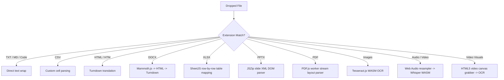

# ToMD: Pure Client-Side File-to-Markdown Converter (v2.0.0)

ToMD is a highly responsive, modern, and 100% serverless web application that converts a wide variety of documents and media formats into clean, structured Markdown. 

Unlike typical file converters that process files on remote servers, **ToMD runs entirely in the browser**. Using WebAssembly (WASM), native browser APIs, and localized JavaScript libraries, it delivers rapid, secure, and private conversions without any backend requirements or network uploads.

---

## Technical Architecture & Codebase Layout

The project has been refactored into a completely flat, client-side static site architecture. All third-party libraries, styling resources, and machine learning models are hosted locally within the repository to enable fully offline, air-gapped operations.

```
/Users/bhanuvardhan/customscripts/tomd/
├── index.html           # Main semantic structure, UI components & scripts loader
├── index.css            # Custom CSS system (gradients, CSS grids, responsive layout, glassmorphism)
├── app.js               # Frontend controller orchestrating the entire file-parsing pipeline
├── favicon.ico          # Application favicon
├── lib/                 # Localized JS/WASM dependencies (No external CDNs)
│   ├── marked.min.js          # Fast markdown parser for HTML preview
│   ├── purify.min.js          # DOMPurify to sanitize parsed HTML preview against XSS
│   ├── prism.min.js           # Prism code highlighter engine
│   ├── prism-*.min.js         # Syntax highlighters for JavaScript, Python, JSON
│   ├── prism-tomorrow.min.css # Visual syntax highlight theme stylesheet
│   ├── pdf.min.js             # PDF.js main text extraction library
│   ├── pdf.worker.min.js      # PDF.js background worker thread script
│   ├── mammoth.browser.min.js # Mammoth.js browser Word DOCX parsing engine
│   ├── xlsx.full.min.js       # SheetJS spreadsheet workbook parsing engine
│   ├── jszip.min.js           # JSZip zip decompilation helper (PPTX slides extractor)
│   ├── turndown.js            # Turndown HTML-to-Markdown translator engine
│   ├── tesseract.min.js       # Tesseract.js main OCR wrapper
│   ├── tesseract-worker.min.js# Tesseract.js execution worker
│   ├── tesseract-core.wasm    # Tesseract.js WebAssembly optical OCR build
│   ├── tesseract-core.wasm.js # Tesseract.js WebAssembly JS connector glue
│   ├── lang-data/             # Localized language dictionary models
│   │   └── eng.traineddata.gz # English language model package for OCR (10MB)
│   └── transformers.js        # Hugging Face Transformers.js v2 engine for ONNX execution
└── models/              # Local machine learning model store
    └── Xenova/
        └── whisper-tiny.en/   # Pre-quantized local Whisper Tiny English model weights (~80MB)
```

For more details on the setup and implementation, inspect:
*   [index.html](file:///Users/bhanuvardhan/customscripts/tomd/index.html)
*   [app.js](file:///Users/bhanuvardhan/customscripts/tomd/app.js)
*   [index.css](file:///Users/bhanuvardhan/customscripts/tomd/index.css)
*   [lib/](file:///Users/bhanuvardhan/customscripts/tomd/lib/)
*   [models/](file:///Users/bhanuvardhan/customscripts/tomd/models/)

---

## Supported Formats & Parsing Engines

The conversion routing is defined inside [app.js](file:///Users/bhanuvardhan/customscripts/tomd/app.js). Files are processed client-side according to extension types, loading appropriate WASM/JS sub-modules into browser memory.



### 1. Document & Table Extractor Adapters
*   **PDF (`.pdf`)**: Extracted block-by-block using [pdf.min.js](file:///Users/bhanuvardhan/customscripts/tomd/lib/pdf.min.js) and its corresponding background thread worker [pdf.worker.min.js](file:///Users/bhanuvardhan/customscripts/tomd/lib/pdf.worker.min.js). Text coordinates are sorted dynamically to reconstruct exact column layouts and spacing.
*   **Word (`.docx`)**: Decompiled via [mammoth.browser.min.js](file:///Users/bhanuvardhan/customscripts/tomd/lib/mammoth.browser.min.js) into clean inline HTML tags, which are then run through the Turndown translator to export standard Markdown formatting.
*   **Excel (`.xlsx`)**: Parsed page-by-page using [xlsx.full.min.js](file:///Users/bhanuvardhan/customscripts/tomd/lib/xlsx.full.min.js). Cells are structured into rows, empty cells are padded, and sheet grids are formatted as standard Markdown tables.
*   **PowerPoint (`.pptx`)**: Slide structures are extracted as XML files from the container zip archive using [jszip.min.js](file:///Users/bhanuvardhan/customscripts/tomd/lib/jszip.min.js). Slide texts are extracted from text nodes (`a:t`), mapped slide-by-slide, and formatted with custom header dividers.
*   **HTML (`.html`, `.htm`)**: Translated directly into clean Markdown syntax via [turndown.js](file:///Users/bhanuvardhan/customscripts/tomd/lib/turndown.js).
*   **CSV (`.csv`)**: Split by row and commas, sanitized of outer quotes, and reconstructed into markdown layout tables.
*   **JSON / XML**: Pretty-printed and wrapped inside code blocks.
*   **Plain Text / Source Code**: Auto-detects extensions (e.g. `.py`, `.js`, `.ts`, `.rs`, `.go`) and embeds them into fenced code blocks with appropriate syntax highlighting tags.

### 2. OCR Scan Engine (Images)
*   **Images (`.png`, `.jpg`, `.jpeg`, `.webp`, `.bmp`, `.gif`, `.tiff`)**: Leverages [tesseract.min.js](file:///Users/bhanuvardhan/customscripts/tomd/lib/tesseract.min.js) and [tesseract-core.wasm](file:///Users/bhanuvardhan/customscripts/tomd/lib/tesseract-core.wasm) to run high-performance Optical Character Recognition. Language assets (`eng.traineddata.gz`) are fetched locally from [lib/lang-data/](file:///Users/bhanuvardhan/customscripts/tomd/lib/lang-data/), avoiding external network fetches.

### 3. Media Engines (Audio & Video Speech-to-Text)
*   **Audio/Video (`.mp3`, `.wav`, `.m4a`, `.mp4`, `.mkv`, `.avi`, `.webm`, etc.)**: 
    1.  The browser's native **Web Audio API** (`AudioContext`) decodes the input file's audio track and resamples it to 16kHz mono.
    2.  The raw audio array is processed using a speech-to-text pipeline from **Transformers.js** ([lib/transformers.js](file:///Users/bhanuvardhan/customscripts/tomd/lib/transformers.js)).
    3.  A quantized ONNX model for **Whisper Tiny English** (`whisper-tiny.en`), hosted locally in [models/Xenova/whisper-tiny.en/](file:///Users/bhanuvardhan/customscripts/tomd/models/Xenova/whisper-tiny.en/), executes the transcription locally inside the browser. Timestamps are formatted into a structured markdown transcript table.
*   **Video Keyframe OCR**: For video files, a dynamic HTML5 `<video>` element is created. The engine programmatically seeks and captures video frames at configurable intervals (e.g., every 30 seconds) onto a hidden `<canvas>`, extracts them as raw image data URLs, and parses them via Tesseract.js OCR. Consecutive repeating visual content is deduplicated using string similarity filters.

---

## Performance & Limits

*   **Max File Size Limit**: Configured to process files up to **500 MB** directly in browser memory.
*   **Offline-Ready / Air-gapped**: The application does not require an active internet connection once loaded. There are zero requests made to external CDNs or APIs (e.g., Hugging Face Hub, Tesseract CDN). Everything is loaded via relative paths like `./lib/` and `./models/`.
*   **Zero Storage Overhead**: Because files are processed entirely client-side, uploaded assets and converted outputs are never saved to a server or external database. Outputs are temporarily kept as browser memory Blobs and downloaded locally.

---

## Deployment & Hosting

Deploying ToMD is trivial because it consists entirely of static client-side files (`HTML`, `CSS`, `JS`, `WASM`, `traineddata`, and `ONNX`).

### Deploy to GitHub Pages
1. Push this directory to your GitHub repository:
   ```bash
   git init
   git add .
   git commit -m "Deploy client-side ToMD v2.0"
   git remote add origin https://github.com/your-username/your-repo-name.git
   git branch -M main
   git push -u origin main
   ```
2. Open the repository on GitHub, and navigate to **Settings** -> **Pages**.
3. Under **Build and deployment**, select **Deploy from a branch**.
4. Set the branch to `main` and path to `/ (root)`.
5. Click **Save**. Within a few minutes, your static app will be live!

### Local Development / Testing
To test or run the app locally, you can serve the directory using a simple HTTP server. 

> [!IMPORTANT]
> Running the app by double-clicking the `index.html` file (using the `file://` protocol) will fail due to browser CORS security policies restricting Web Worker, WebAssembly, and local module imports. Always serve the files via a local HTTP server.

**Option 1: Using Python**
```bash
python3 -m http.server 8001
```

**Option 2: Using Node.js**
```bash
npx serve . -p 8001
```

Once running, navigate to `http://localhost:8001/` in your browser.
